# 
 Task progress

Vision
======

 “Task progress” is web-application which allows users to record
 information about tasks, teams, activity by tasks and measure percent
 of completion.

 Application should provide:

-   Storing tasks, teams and activity by tasks in a database;

-   Display list of tasks and preparation progress and cleaning
    progress;

-   Updating the list of tasks (adding, removing);

-   Display list of teams;

-   Updating the list of teams (adding, editing, removing);

-   Display list of activity;

-   Updating the list of activity (adding, editing, removing);

-   Filtering by activity date;

-   Filtering by team name.

# 1. Tasks

## 1.1 Display list of Tasks

The mode is designed to view the list of tasks and a percent of completion

### Main scenario:

-   User selects item “Tasks”;

-   Application displays list of Tasks.

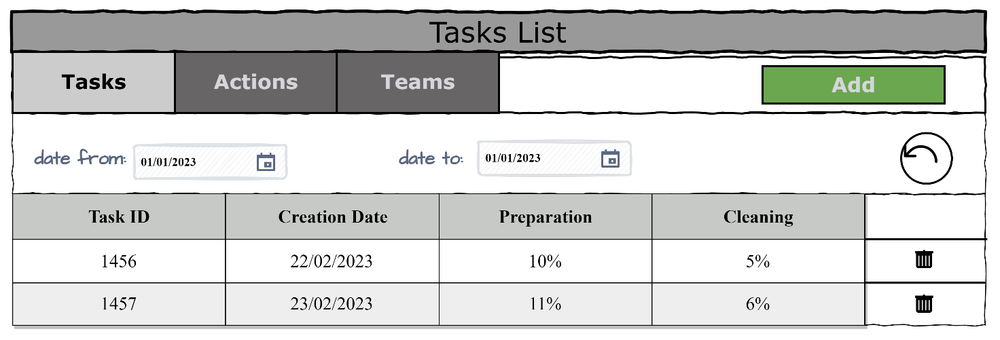

> Pic. 1.1 View the Tasks List

The list displays the following columns:

-   Task ID – unique task number;

-   Creation Date – date of adding a task;

-   Preparation – percentage of completion of preparatory work;

-   Cleaning – percentage
    of completion of cleaning work;

Aggregate function: Preparation = sum of all percent with type of
activity is preparation,

Cleaning = sum of all percent with type of activity is cleaning.

### Filtering by date:

-   In the task list view mode, the user sets a date filter and presses the refresh list button (to the right of the date entry field);

-   The application will display a form to view the list of tasks with
    updated data.

## 1.2 Add Task

### Main scenario:

-   User clicks the “Add” button in the tasks list view mode;

-   Application displays form to enter task data;

-   User enters task data and presses “Save” button;

-   If any data is entered incorrectly, incorrect data messages are
    displayed;

-   If entered data is valid, then record is adding to database;

-   If error occurs, then error message is displaying;

-   If new task record is successfully added, then list of tasks with
    added records is displaying.

### Cancel operation scenario:

-   User clicks the “Add” button in the task list view mode;

-   Application displays form to enter task data;

-   User enters task data and presses “Cancel” button;

-   Data don’t save in data base, then list of tasks records is
    displaying to user.

-   If the user selects the menu item "Tasks”, “Activities” or "Teams",
    the data will not be saved to the database and the corresponding
    form with updated data will be opened.

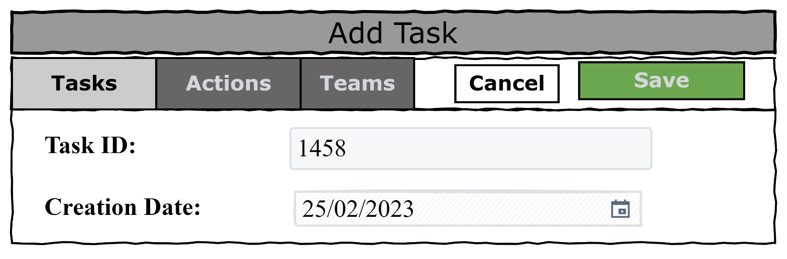

> Pic. 1.2 Add Task

When adding a task, the following details are entered:

-   Task ID – unique task number;

-   Creation Date – date of adding a task.

Constraints for data validation:

-   Task ID – unique, integer type.

## 1.3 Removing the Task

### Main scenario:

-   The user, while in the list of tasks, presses the "Delete" button in the selected task line;

-   If the task can be removed, a confirmation dialog is displayed;

-   The user confirms the removal of the task;

-   Record is deleted from database;

-   If error occurs, then error message displays;

-   If task record is successfully deleted, then list of tasks without
    deleted records is displaying.

### Cancel operation scenario:

-   User is in display mode of tasks list and press “Delete” button;

-   Application displays confirmation dialog “Please confirm delete task?”;

-   User press “Cancel” button;

-   List of tasks without changes is displaying.

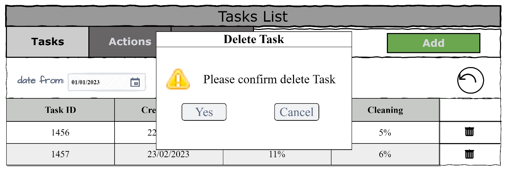

> Pic. 1.3 Delete Task dialog

## 2. Actions

## 2.1 Display list of Actions

This mode is intended for viewing and editing the actions list.

### Main scenario:

-   User selects item “Actions”;

-   Application displays list of actions.

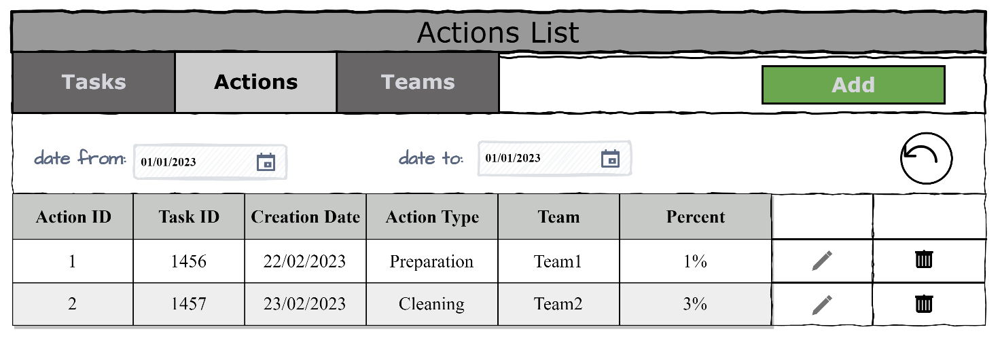

> Pic. 2.1 View the Actions List

The list displays the following columns:

-   Action ID – unique action number;

-   Task ID – unique task number;

-   Creation Date – date of adding a task;

-   Action Type – type of activity: Preparation or Cleaning

-   Team – team name;

-   Percent – percentage of completion of task.

### Filtering by date:

-   In the actions list view mode, the user sets a date filter and\
presses the refresh list button (to the right of the date entry field);

-   The application will show the actions only for a certain period
    of time.

Restrictions:

-   Start date of the period should be less then end date of the period;

-   If start date is blank, then filtering by end date only.

-   If end date is blank, then filtering by start date only.

-   Updating data after selecting the filtering conditions is carried
    out by pressing the “Refresh” button

## 2.2 Add Action

### Main scenario:

-   User clicks the “Add” button in the actions list view mode;

-   Application displays form to enter action data;

-   User enters action’s data and presses “Save” button;

-   If any data is entered incorrectly, incorrect data messages are
    displayed;

-   If entered data is valid, then record is adding to database;

-   If error occurs, then error message is displaying;

-   If new action record is successfully added, then list of actions
    with added records is displaying.

### Cancel operation scenario:

-   User clicks the “Add” button in the actions list view mode;

-   Application displays form to enter action’s data;

-   User enters action’s data and presses “Cancel” button;

-   Data don’t save in database, then list of actions records is
    displaying to user.

-   If the user selects the menu item ”Tasks”, “Actions” or "Teams", the
    data will not be saved to the database and the corresponding form
    with updated data will be opened.

 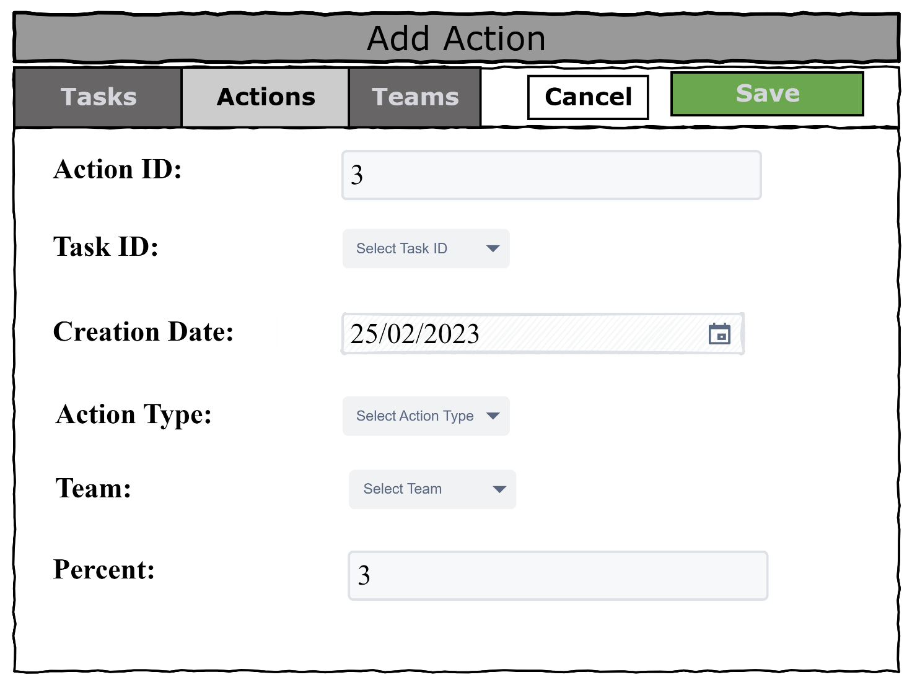

> Pic. 2.2 Add Action

When adding an action, the following details are entered:

-   Action ID – unique action number;

-   Task ID – unique task number;

-   Creation Date – date of adding a task;

-   Action Type – type of activity;

-   Team – team name;

-   Percent – percentage of completion of task.

Constraints for data validation:

-   Action ID – unique, integer type;

-   Task ID – ID of existing task;

-   Action Type – selected element is Preparation or Cleaning;

-   Team – team name of existing team;

-   Percent – summary of all added percent for task by activity type
    less than 100%.

## 2.3 Edit Action

### Main scenario:

-   User clicks the “Edit” button in the actions list view mode;

-   Application displays form to enter action data;

-   User enters action’s data and presses “Save” button;

-   If any data is entered incorrectly, incorrect data messages are
    displayed;

-   If entered data is valid, then edited data is added to database;

-   If error occurs, then error message is displaying;

-   If action’s record is successfully edited, then list of actions with
    added records is displaying.

### Cancel operation scenario:

-   User clicks the “Edit” button in the actions list view mode;

-   Application displays form to enter action data;

-   User enters action data and presses “Cancel” button;

-   Data don’t save in data base, then list of actions records is
    displaying to user.

-   If the user selects the menu item "Tasks”, ”Actions” or "Teams", the
    data will not be saved to the database and the corresponding form
    with updated data will be opened.

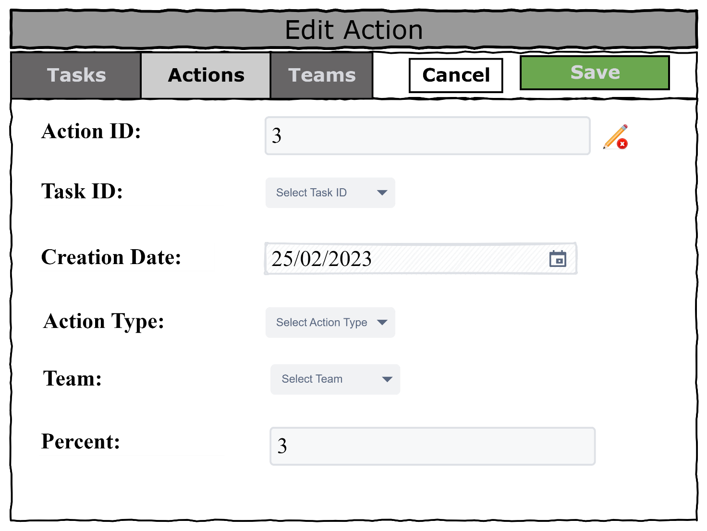

> Pic. 2.3 Edit Action

## 2.4 Removing Action

### Main scenario:

-   The user, while in the list of actions mode, presses the "Delete"\ 
    button in the selected action line;

-   Application displays confirmation dialog “Please confirm delete
    action”;

-   The user confirms the removal of the action;

-   Record is deleted from database;

-   If error occurs, then error message displays;

-   If action record is successfully deleted, then list of actions
    without deleted records is displaying.

### Cancel operation scenario:

-   User is in display mode of actions list and press “Delete” button;

-   Application displays confirmation dialog “Please confirm delete Action”;

-   User press “Cancel” button;

-   List of actions without changes is displaying.

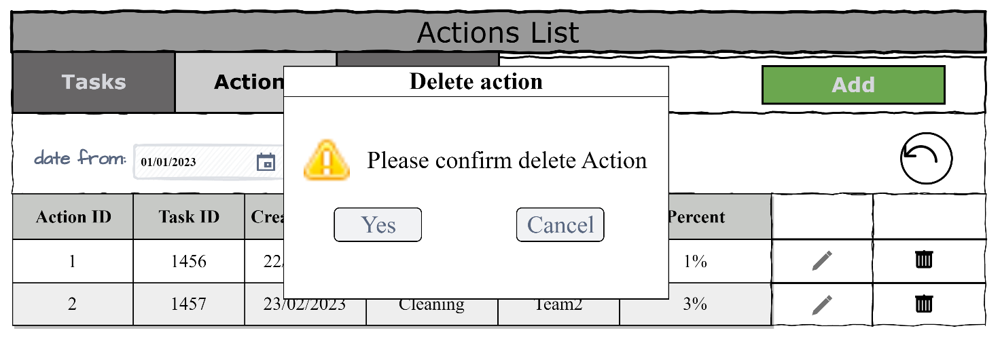

> Pic. 2.4 Delete Action dialog

## 3. Teams

### 3.1 Display list of teams

This mode is intended for viewing and editing the teams list

### Main scenario:

-   User selects item “Teams”;

-   Application displays list of teams.

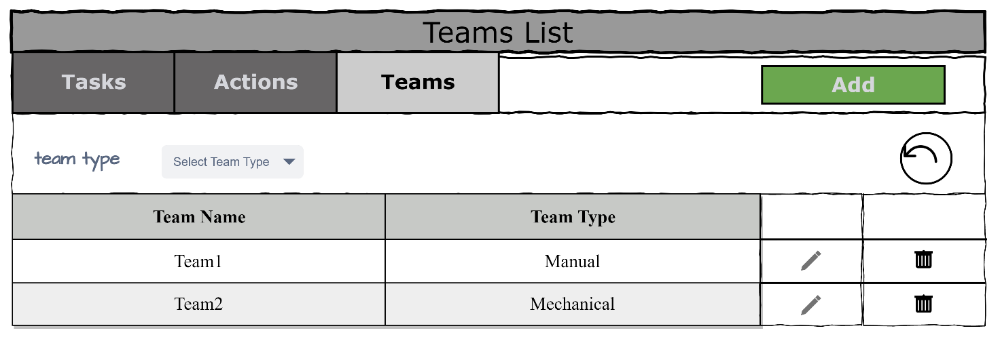

> Pic. 3.1 View the Teams List

The list displays the following columns:

-   Tean Name – unique team name;

-   Team Type – type of team.

### Filtering by team typet:

-   In the teams list view mode, the user sets a team type filter and\
    presses the refresh list button (to the right of the team type entry field);

-   The application will display a form to view the list of teams with
    updated data.

## 3.2 Add Team

### Main scenario:

-   User clicks the “Add” button in the team list view mode;

-   Application displays form to enter team data;

-   User enters team data and presses “Save” button;

-   If any data is entered incorrectly, incorrect data messages are
    displayed;

-   If entered data is valid, then record is adding to database;

-   If error occurs, then error message is displaying;

-   If new team record is successfully added, then list of teams with
    added records is displaying.

### Cancel operation scenario:

-   User clicks the “Add” button in the teams list view mode;

-   Application displays form to enter team data;

-   User enters team data and presses “Cancel” button;

-   Data don’t save in data base, then list of teams records is displaying to user.

-   If the user selects the menu item "Tasks”, “Actions” or "Teams", the
    data will not be saved to the database and the corresponding form
    with updated data will be opened.

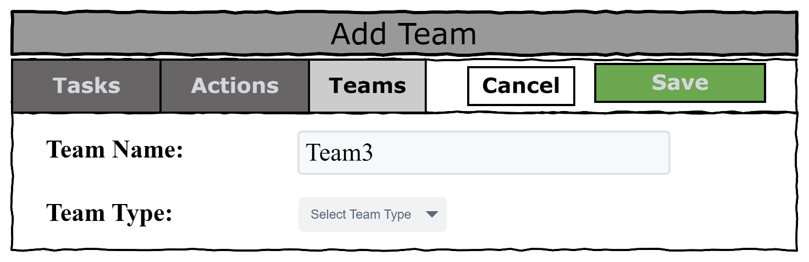

> Pic. 3.2 Add Team

When adding a team, the following details are entered:

-   Team Name – team’s unique name;

-   Team Type – type of team.

Constraints for data validation:

-   Team Name – unique, team name starts from word “Team” and integer\
    number without space;

-   Team Type - selected element is Manual or Mechanical.

## 3.3 Edit Team

### Main scenario:

-   User clicks the “Edit” button in the teams list view mode;

-   Application displays form to enter team data;

-   User enters team data and presses “Save” button;

-   If any data is entered incorrectly, incorrect data messages are
    displayed;

-   If entered data is valid, then edited data is added to database;

-   If error occurs, then error message is displaying;

-   If team record is successfully edited, then list of teams with added
    records is displaying.

### Cancel operation scenario:

-   User clicks the “Edit” button in the teams list view mode;

-   Application displays form to enter team data;

-   User enters team data and presses “Cancel” button;

-   Data don’t save in data base, then list of teams records is
    displaying to user.

-   If the user selects the menu item "Tasks”, “Actions” or "Teams",\
    the data will not be saved to the database and the corresponding form with updated data will be opened.

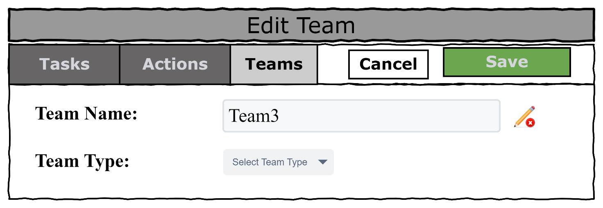

> Pic. 3.3 Edit Team

## 3.4 Removing the Team

### Main scenario:

-   The user, while in the list of teams mode, presses the "Delete" button in the selected team line;

-   Application displays confirmation dialog “Please confirm delete
    Team”;

-   The user confirms the removal of the team;

-   Record is deleted from database;

-   If error occurs, then error message displays;

-   If team record is successfully deleted, then list of teams without
    deleted records is displaying.

### Cancel operation scenario:

-   User is in display mode of teams list and press “Delete” button;

-   Application displays confirmation dialog “Please confirm delete Team”;

-   User press “Cancel” button;

-   List of teams without changes is displaying.

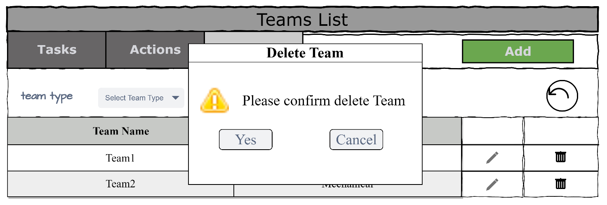

> Pic. 3.4 Delete Team dialog
